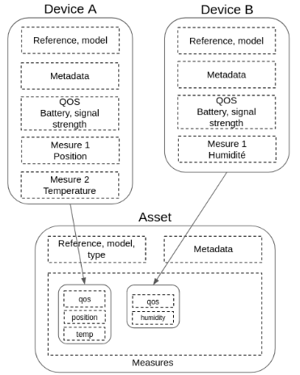

# Assets

An asset document represents the physical asset to which one or more devices can be linked.

The document contains asset identification information, the latest measurements received by the associated devices and their metadata.

An asset is uniquely identified by the `type` + `model` + `reference` triplet.

**Example:** _Asset document with a GPS measure_

```js
{
  "type": "<asset type>",
  "model": "<asset model designation>",
  "reference": "<asset model unique identifier>",

  "measures": {
    "position": {
      "id": "<associated device unique identifier>",
      "model": "<associated device model>",
      "reference": "<associated device reference>",
      "metadata": {
        // associated device metadata
      },
      "updatedAt": "<timestamp of the measure>",
      "payloadUuid": "<identifier of the received payload>",
      "latitude": 41.074688,
      "longitude": 28.9800192,
      "accuracy": 42,
      "altitude": 12
    }
  },

  "metadata": {
    "owner": "Ayse"
  },
}
```

## Copy measures from devices

When a device is attached to an asset, it will automatically propagate the new measurements it receives into the asset's `measures` property.

By default, for each measurement type the following information are copied in addition of the measure content:
 - `id`: device document unique identifier
 - `model`: device model
 - `reference`: device reference
 - `qos`: device qos info



**Example:** _Content of asset document linked to a device with a temperature measure_
```js
{
  "reference": "XYZ-42-AZE",
  "model": "PERFO-GTX1",
  "metadata": {},

  "measures": {
    "temperature": {
      "id": "IneoGTO42-98765poiuyt",
      "model": "IneoGTO42",
      "reference": "98765poiuyt",
      "qos": {
        "battery": 2.3
      },

      // Measure content
      "updatedAt": 1610561030361,
      "payloadUuid": "...",
      "degree": 23.3,
    }
  },
}
```

It is possible to override the [Decoder.copyToAsset](/official-plugins/device-manager/1/classes/decoder/copy-to-asset) method to choose what to copy into the asset.
