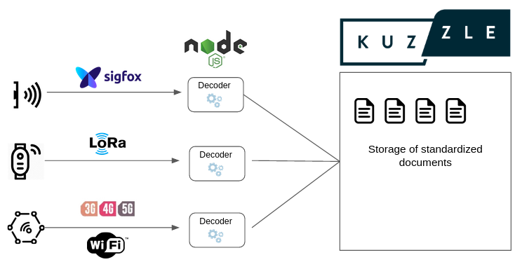

# Decoders

Each device model can receive a different payload, it is then necessary to decode this payload in order to retrieve the necessary information and put it in the right place in the document of the associated device.



To do this, it is necessary to implement a decoder by implementing the `Decoder` class.

This class must at least implement the `decode` method in order to retrieve at the right place the payload data.

A decoder is linked to a device model. Its registration triggers the creation of a specific API action to receive payloads from this device model. Each payload will be decoded by the decoder provided.

**Example:** _Decoder for the device model "Karakoy"_

```js
// "Karakoy" device payload
{
  deviceEUI: '12345',
  register55: 23.3,
  batteryLevel: 0.8,
}
```

```js
import { JSONObject, KuzzleRequest } from 'kuzzle';
import { Decoder, DeviceContent, DeviceManager } from 'kuzzle-plugin-device-manager';

const deviceManager = new DeviceManager();

class KarakoyDecoder extends Decoder {
  constructor () {
    super("Karakoy");
  }

  async decode (payload: JSONObject, request: KuzzleRequest): Promise<DeviceContent> {
    const deviceContent: DeviceContent = {
      reference: payload.deviceEUI,
      measures: {
        temperature: {
          updatedAt: Date.now(),
          value: payload.register55,
        }
      },
      qos: {
        battery: payload.batteryLevel * 100
      }
    };

    return deviceContent;
  }
}

deviceManager.registerDecoder(new KarakoyDecoder());
```

## Receive payloads

When registering a decoder, a corresponding API action is registered in the `device-manager/payload` controller.

The API action name is the name of the model in `kebab-case`.

The generated URL is the following: `POST /_/device-manager/payload/<model-kebab-case>`.

You can specify a custom API action and custom HTTP routes by defining the `action` and `http` properties of the decoder class.

```js
class KarakoyDecoder extends Decoder {
  constructor () {
    super("Karakoy");

    // Generated API action: "device-manager/payload:karakoy-v1"
    this.action = 'karakoy-v1';

    // Generated HTTP route: PUT /_/v1/device-manager/payload/karakoy
    this.http = [
      { verb: 'put', path: 'v1/device-manager/payload/karakoy' }
    ];
  }
}
```

## Action results

Each action will return an object containing those 3 properties:
 - `device`: device document
 - `tenantId`: device tenant ID (only if the device was attached to a tenant)
 - `asset`: asset document (only if the device was linked to an asset)

## Hooks 

You can then use lifecycle hooks to modify a payload while it's been processed

  - `validate`: Validates the payload format before processing
  - `beforeRegister`: Enrichment hook executed before registering a device
  - `afterRegister`: Hook executed after registering a device
  - `beforeUpdate`: Enrichment hook executed before updating a device
  - `afterUpdate`: Hook executed after updating a device

See also: [Decoder abstract class](/kuzzle-iot-platform/device-manager/1/classes/decoder).

## Saving raw payloads

Every payload received by Kuzzle will be stored in the `payloads` collection of the admin index.

Each document contains the following property:
  - `uuid`: payload unique identifier (also found in measures)
  - `valid`: payload validity
  - `deviceModel`: device model registered for this payload
  - `payload`: raw payload content
