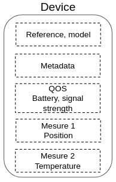

# Devices

A device document represents a physical device.

The document contains device identification information, the last measurement received and the device's metadata.

A device is uniquely identified by the pair `model` + `reference`.



**Example:** _GPS device document_
```js
{
  "model": "<device model designation>",
  "reference": "<device model unique identifier>",
  "measures": {
    "position": {
      "updatedAt": "<timestamp of the measure>",
      "payloadUuid": "<identifier of the received payload>",
      "latitude": 41.074688,
      "longitude": 28.9800192,
      "accuracy": 42,
      "altitude": 12
    }
  },
  "metadata": {
    "groupe": "red-team"
  },
  "qos": {
    "battery": 86
  },
  "tenantId": null,
  "assetId": null
}
```

## Measures

A device can receive several measurements in the same payload.

Each measurement must be stored in the key corresponding to its type: `measures.<measureType>`.

The plugin provides the following measurement types:

  - `position`: stores a GPS location
  - `temperature`: stores a temperature

<details><summary>See associated mappings</summary>

```js
{
  // [...]
  measures: {
    properties: {
      temperature: {
        properties: {
          updatedAt: { type: 'date' },
          payloadUuid: { type: 'keyword' },
          value: { type: 'float' },
        }
      },
      position: {
        properties: {
          updatedAt: { type: 'date' },
          payloadUuid: { type: 'keyword' },

          latitude: { type: 'float' },
          longitude: { type: 'float' },
          altitude: { type: 'float' },
          accuracy: { type: 'integer' },
        }
      },
    }
  },
}
```

</details>

It is possible to define custom measurement types by declaring them when initializing the plugin:

```js
import { DeviceManager } from 'kuzzle-plugin-device-manager';

const deviceManager = new DeviceManager();

// Declare a new "humidity" measure
deviceManager.mappings.devices.measures = {
  humidity: {
    properties: {
      updatedAt: { type: 'date' },
      payloadUuid: { type: 'keyword' },
      value: { type: 'float' },
    }
  }
};
```

## Attach to a tenant

Devices can be attached to tenant by using the [device-manager/device:attach](/kuzzle-iot-platform/device-manager/1/controllers/device/attach) API action.

When attached, the device document is copied inside the `devices` collection of the tenant index.

## Attach to multiple tenant

Multiple different Devices can also be attached to multiple defferents tenant by using the [device-manager/device:mAttach](/kuzzle-iot-platform/device-manager/1/controllers/device/m-attach) API action.

The format used can be either __CSV__ in the form of a string in the format `tenantId,deviceId\nmytenantId,mydeviceId` or __JSON__ in the form of an array of objects `"records": [{ "tenantId": "mytenantId", "deviceId": "mydeviceId"}]`.

When attached, all devices documents are copied inside the `devices` collections of all different tenant index.

## Detach a device from a tenant

Sensors can be detached to tenant by using the [device-manager/device:detach](/kuzzle-iot-platform/device-manager/1/controllers/device/detach) API action.

When detached, the device document is deleted from the `devices` collection of the tenant index.

the `tenantId` property is set to `null` in the `device-manager` index.
## Detach multiple devices from multiple tenants

Multiple different Sensors can also be detached to multiple defferents tenant by using the [device-manager/device:mDetach](/kuzzle-iot-platform/device-manager/1/controllers/device/mDetach) API action.

The format used can be either __CSV__ in the form of a string in the format "tenantId, deviceId, myDeviceId" or __JSON__ in the form of an array of objects.

When detached, all devices documents are deleted from the `devices` collections of all different tenant index.

The `tenantId` property is set to `null` for all of them in the `device-manager` index

## Link to an asset

Devices can be linked to an asset by using the [device-manager/device:link](/kuzzle-iot-platform/device-manager/1/controllers/device/link) API action.

When linked, the device measures are copied inside the asset document.

New measures received by the device will be propagated inside the asset document.

## Link Multiple Devices to Multiple Assets

Multiple Devices can be linked at the same time to multiple assets by using the [device-manager/device:mLink](/kuzzle-iot-platform/device-manager/1/controllers/device/m-link) API action.

Once linked, each device's measures are copied inside their corresponding asset document.

New measures received by the device will be propagated inside each assets documents.


## unlink from an asset

Devices can be unlinked from an asset by using the [device-manager/device:unlink](/kuzzle-iot-platform/device-manager/1/controllers/device/unlink) API action.

When unlinked, the device measures are erased inside the asset document.

## unlink Multiple Devices to Multiple Assets

Multiple Devices can be unlinked at the same time from multiple assets by using the [device-manager/device:mUnlink](/kuzzle-iot-platform/device-manager/1/controllers/device/m-unlink) API action.

Once unlinked, each device's measures are erased inside their corresponding asset document.

## Metadata

It is possible to attach metadata to the devices within the `metadata` property.

It is possible to define `metadata` property mappings by declaring them at plugin initialization:

```js
import { DeviceManager } from 'kuzzle-plugin-device-manager';

const deviceManager = new DeviceManager();

// Declare a "group" metadata of type "keyword"
deviceManager.mappings.devices.metadata = {
  group: { type: 'keyword' }
};
```

## QOS

Alongside measures, a device may send information about its state (e.g. battery, signal strenght, etc.)

Those information should be stored in the `qos` property.

They will be copied alongside measures when the device in linked to an asset.

It is possible to define the `qos` property mappings by declaring them at plugin initialization:

```js
import { DeviceManager } from 'kuzzle-plugin-device-manager';

const deviceManager = new DeviceManager();

// Declare a "battery" metadata of type "integer"
deviceManager.mappings.devices.qos = {
  battery: { type: 'integer' }
};
```
