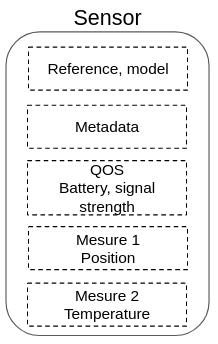

# Sensors

A sensor document represents a physical sensor.

The document contains sensor identification information, the last measurement received and the sensor's metadata.

A sensor is uniquely identified by the pair `model` + `reference`.



**Example:** _GPS sensor document_
```js
{
  "model": "<sensor model designation>",
  "reference": "<sensor model unique identifier>",
  "measures": {
    "position": {
      "updatedAt": "<timestamp of the measure>",
      "payloadUuid": "<identifier of the received payload>",
      "latitude": 41.074688,
      "longitude": 28.9800192,
      "accuracy": 42,
      "altitude": 12
    }
  },
  "metadata": {
    "groupe": "red-team"
  },
  "qos": {
    "battery": 86
  },
  "tenantId": null,
  "assetId": null
}
```

## Measures

A sensor can receive several measurements in the same payload.

Each measurement must be stored in the key corresponding to its type: `measures.<measureType>`.

The plugin provides the following measurement types:

  - `position`: stores a GPS location
  - `temperature`: stores a temperature

<details><summary>See associated mappings</summary>

```js
{
  // [...]
  measures: {
    properties: {
      temperature: {
        properties: {
          updatedAt: { type: 'date' },
          payloadUuid: { type: 'keyword' },
          value: { type: 'float' },
        }
      },
      position: {
        properties: {
          updatedAt: { type: 'date' },
          payloadUuid: { type: 'keyword' },

          latitude: { type: 'float' },
          longitude: { type: 'float' },
          altitude: { type: 'float' },
          accuracy: { type: 'integer' },
        }
      },
    }
  },
}
```

</details>

It is possible to define custom measurement types by declaring them when initializing the plugin:

```js
import { DeviceManager } from 'kuzzle-plugin-device-manager';

const deviceManager = new DeviceManager();

// Declare a new "humidity" measure 
deviceManager.mappings.sensors.measures = {
  humidity: {
    properties: {
      updatedAt: { type: 'date' },
      payloadUuid: { type: 'keyword' },
      value: { type: 'float' },
    }
  }
};
```

## Attach to a tenant

Sensors can be attached to tenant by using the [device-manager/sensor:attach](/kuzzle-iot-platform/device-manager/1/controllers/sensor/attach) API action.

When attached, the sensor document is copied inside the `sensors` collection of the tenant index.

## Attach to multiple tenant

Multiple different Sensors can also be attached to multiple defferents tenant by using the [device-manager/sensor:mAttach](/kuzzle-iot-platform/device-manager/1/controllers/sensor/mAttach) API action.

The format used can be either __CSV__ in the form of a string in the format "tenantId,sensorId,mysensorId" or __JSON__ in the form of an array of objects.

When attached, all sensors documents are copied inside the `sensors` collections of all different tenant index.

## Dettach a sensor from a tenant

Sensors can be dettached to tenant by using the [device-manager/sensor:dettach](/kuzzle-iot-platform/device-manager/1/controllers/sensor/dettach) API action.

When dettached, the sensor document is deleted from the `sensors` collection of the tenant index.

the `tenantId` property is set to `null` in the `device-manager` index.
## Dettach multiple sensors from multiple tenants

Multiple different Sensors can also be dettached to multiple defferents tenant by using the [device-manager/sensor:mDettach](/kuzzle-iot-platform/device-manager/1/controllers/sensor/mDettach) API action.

The format used can be either __CSV__ in the form of a string in the format "tenantId,sensorId,mysensorId" or __JSON__ in the form of an array of objects.

When dettached, all sensors documents are deleted from the `sensors` collections of all different tenant index.

The `tenantId` property is set to `null` for all of them in the `device-manager` index

## Link to an asset

Sensors can be linked to an asset by using the [device-manager/sensor:link](/kuzzle-iot-platform/device-manager/1/controllers/sensor/link) API action.

When linked, the sensor measures are copied inside the asset document.

New measures received by the sensor will be propagated inside the asset document.

## Metadata

It is possible to attach metadata to the sensors within the `metadata` property.

It is possible to define `metadata` property mappings by declaring them at plugin initialization:

```js
import { DeviceManager } from 'kuzzle-plugin-device-manager';

const deviceManager = new DeviceManager();

// Declare a "group" metadata of type "keyword" 
deviceManager.mappings.sensors.metadata = {
  group: { type: 'keyword' }
};
```

## QOS

Alongside measures, a sensor may send information about its state (e.g. battery, signal strenght, etc.)

Those information should be stored in the `qos` property.

They will be copied alongside measures when the sensor in linked to an asset.

It is possible to define the `qos` property mappings by declaring them at plugin initialization:

```js
import { DeviceManager } from 'kuzzle-plugin-device-manager';

const deviceManager = new DeviceManager();

// Declare a "battery" metadata of type "integer" 
deviceManager.mappings.sensors.qos = {
  battery: { type: 'integer' }
};
```
