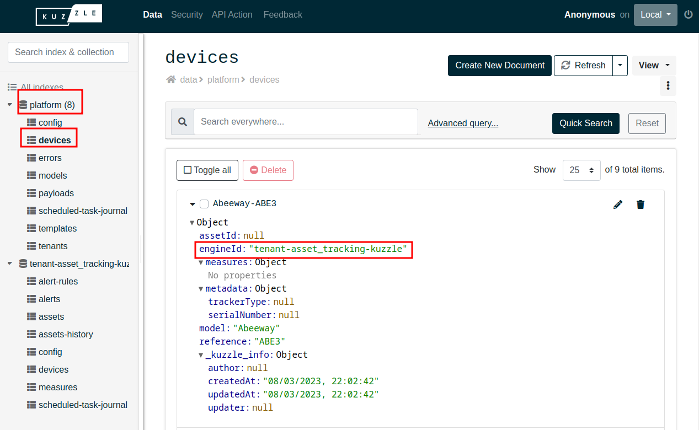
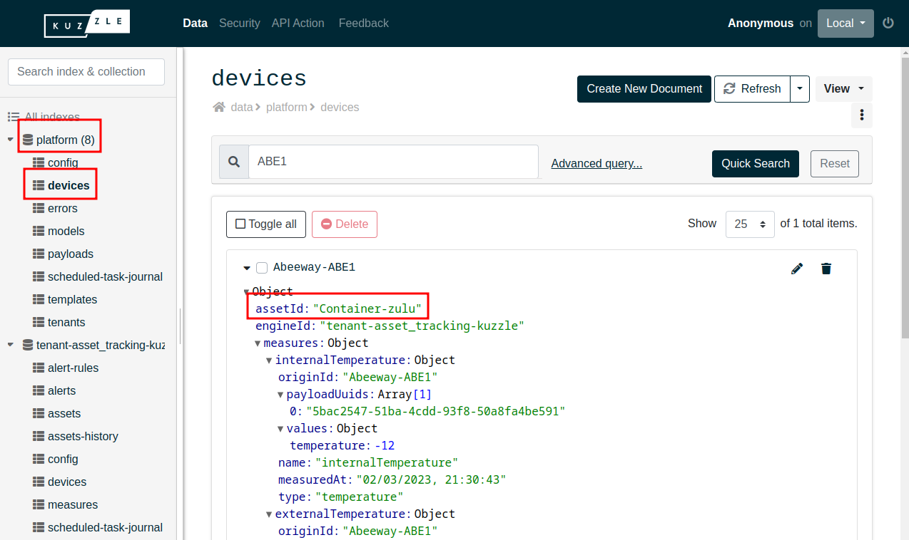
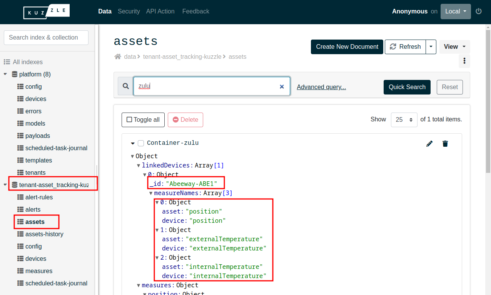

# Measures propagation

The raw data received by the Kuzzle IoT Platform contains measurements that must be propagated within the different entities of the platform.

During this propagation, they will be duplicated several times.

By default, measurements are stored:

- in the `platform/payloads` collection as raw data frames
- in the `platform/devices` collection as embedded measures (`EmbeddedMeasure`)

If **the device is assigned to a tenant**, then the measurements are propagated:

- in the `<tenant>/devices` collection as embedded measures (`EmbeddedMeasure`)
- in the `<tenant>/measures` collection as measures (`MeasureContent`)

If **the device is linked to an asset**, then the linked measurements are propagated:

- in the `<tenant>/assets` collection as embedded measures (`EmbeddedMeasure`)

## Mechanisms of propagation

Propagation is governed by a set of rules contained in devices and assets.

### Propagation in tenant

Tenant propagation occurs when the device is attached to a tenant with the `device-manager/devices:attachTenant` action.

The `engineId` text field of the device contains the index name of the tenant it was attached to.

The measures are then propagated:

- in the `<tenant>/devices` collection as embedded measures (`EmbeddedMeasure`)
- in the `<tenant>/measures` collection as measures (`MeasureContent`)

If this field is `null`, then the device is not attached to a tenant and measurements are not propagated.

It is possible to check the assignment in the Admin Console:

_The `Abeeway-ABE3` device is assigned to the `tenant-asset_tracking-kuzzle` tenant._

### Propagation to asset

The propagation to the asset is done when the device has been linked to an asset with the action `device-manager/devices:linkAsset`.

This leads to several changes:

- `assetId` text field of the device which now contains the asset id
- array field `linkedDevices` of the asset which contains a new element with:
  - the device identifier (`linkedDevices[]._id`)
  - the names of the measures present in the link (`linkedDevices[].measureNames`)

Only measurements declared in the binding (`linkedDevices[].measureNames`) will be available from the asset.

The measures of an asset can be retrieved with the `device-manager/assets:getLastMeasures` action.

It is possible to check the binding in the Admin Console:

_The `Abeeway-ABE1` device is linked to the `Container-zulu` asset_

_The `position` , `externalTemperature` and `internalTemperature` measurements will be propagated from the `Abeeway-ABE1` device to the `Container-zulu` asset_
