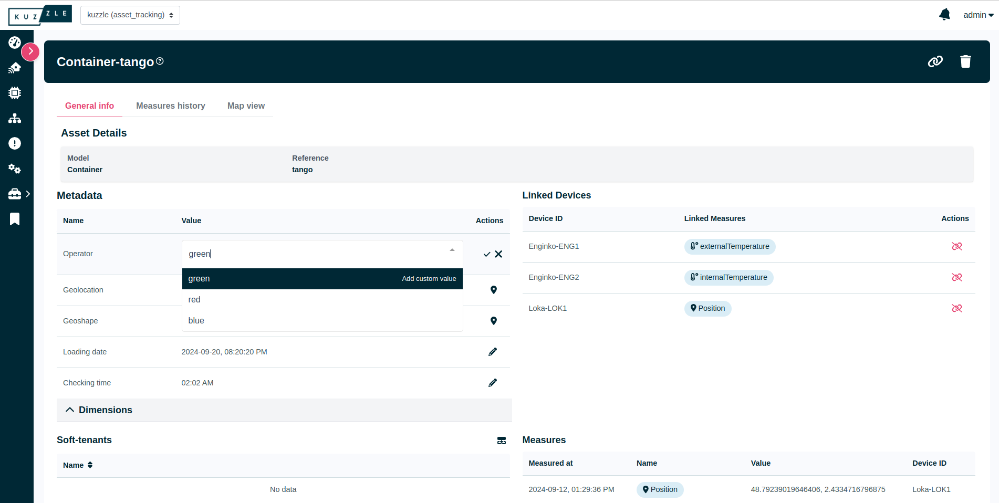
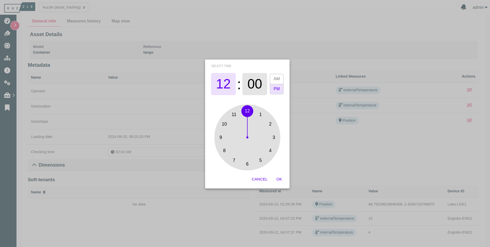

# Metadata details

Define metadata details is a way to enhance the user experience by improving the user interface on the management of metadata of an asset or a device. Even though it is optional to define them, there are multiple features you can use :
- [Group](#group-optional) (**_optional_**)
- [Translation](#translations-mandatory) (**_mandatory_**)
- [Editor hint](#editor-hint-optional) (change UI elements) (**_optional_**)

## Group (_optional_)

This property allows to group a metadata under an accordion dropdown. First create a metadataGroups object at the same level as metadataDetails. Define a property with the name of the group and define localization details. Then in metadataDetails object, associate the group with your metadata under the group property.

**Example**
```js
{
  metadataMappings: {
    company: { type: "keyword" },
  },
  metadataDetails: {
    company: {
      group: "companyInfo",
    },
  },
  metadataGroups: {
    companyInfo: {
      locales: {
        en: {
          groupFriendlyName: "Company Information",
          description: "All company related informations",
        },
        fr: {
          groupFriendlyName: "Informations sur l'entreprise",
          description: "Toutes les informations relatives a l'entreprise",
        },
      },
    },
  },
}
```

## Translations (_mandatory_)

This property allows to add a description to the metadata and change the display name for a more user friendly name. There are translated according to the localization.

```js
{
  metadataMappings: {
    company: { type: "keyword" },
  },
  metadataDetails: {
    locales: {
      en: {
        friendlyName: "Manufacturer",
        description: "The company that manufactured the plane",
      },
      fr: {
        friendlyName: "Fabricant",
        description: "L'entreprise qui a fabriqué l'avion",
      },
    },
  },
}
```

## Editor hint (_optional_)

This property allows to improve the user experience to manage metadata. In the frontend, it can unlock the possibility to display dropdown of values, to chose between a clock picker or date picker with time or not, a read only metadata and so on. You have to set the enum type associated to the hint you want and fill the properties with your values.

This is the list of hints you can use :
- [Read only](#read-only)
- [Dropdown of values](#dropdown-of-values)
- [Date/Datetime/Clock picker](#datedatetimeclock-picker)

<h3 id="read-only" style="color: #e94e77">Read only <a href="#read-only" class="heading-anchor-link">#</a></h3>

In the Iot platform the read only feature allows the user to edit or to only read the metadata.

**NOTE:** The readOnly property can be set with **any** Enum type.

Enum type: `BASE`

:warning: Set to BASE if you **only** want the readOnly property.

<table>
  <thead>
    <tr>
      <th style="background-color: #e94e77" colspan="4" align="center">PROPERTIES</th>
    </tr>
    <tr>
      <th>Name</th>
      <th>Type</th>
      <th>Description</th>
      <th>Optional</th>
    </tr>
  </thead>
  <tbody>
    <tr>
      <td>readOnly</td>
      <td><code>boolean</code></td>
      <td>It displays or not the edit button</td>
      <td>Yes</td>
    </tr>
  </tbody>
</table>

**Example**
```js
{
  metadataMappings: {
    network: { type: "keyword" },
  },
  metadataDetails: {
		network: {
			editorHint: {
				type: EditorHintEnum.BASE,
				readOnly: true,
			},
		},
	}
},
```

<h3 id="dropdown-of-values" style="color: #e94e77">Dropdown of values <a href="#dropdown-of-values" class="heading-anchor-link">#</a></h3>

In the Iot platform the dropdown feature allows to display a list of values to choose in a dropdown, it has to be defined in the the editorHint property of the asset/device metadata details.
 
Enum type: `OPTION_SELECTOR`

<table>
  <thead>
    <tr>
      <th style="background-color: #e94e77" colspan="4" align="center">PROPERTIES</th>
    </tr>
    <tr>
      <th>Name</th>
      <th>Type</th>
      <th>Description</th>
      <th>Optional</th>
    </tr>
  </thead>
  <tbody>
    <tr>
      <td>values</td>
      <td><code>string[] number[] boolean[]</code></td>
      <td>A list that represents all the values displayed in a dropdown.</td>
      <td>No</td>
    </tr>
    <tr>
      <td>customValueAllowed</td>
      <td><code>boolean</code></td>
      <td>It defines if an input is displayed alongside the dropdown to allow the user to choose a value in the dropdown or to inform his custom value.</td>
      <td>Yes</td>
    </tr>
  </tbody>
</table>

**Example**
```js
{
  metadataMappings: {
    company: { type: "keyword" },
  },
  metadataDetails: {
		company: {
			editorHint: {
				type: EditorHintEnum.OPTION_SELECTOR,
				values: ["red", "blue"],
				customValueAllowed: true,
			},
		}
  },
},
```

**Visual**



<h3 id="datedatetimeclock-picker" style="color: #e94e77">Date/Datetime/Clock picker <a href="#datedatetimeclock-picker" class="heading-anchor-link">#</a></h3>


In the Iot platform, this feature allows to display either a calendar picker with or not a time picker or either a clock picker, it has date-datetime-clock-picker editorHint property of the asset/device.

Enum type: `DATETIME`

<table>
  <thead>
    <tr>
      <th style="background-color: #e94e77" colspan="4" align="center">PROPERTIES</th>
    </tr>
    <tr>
      <th>Name</th>
      <th>Type</th>
      <th>Description</th>
      <th>Optional</th>
    </tr>
  </thead>
  <tbody>
    <tr>
      <td>date</td>
      <td><code>boolean</code></td>
      <td>Allows either a calendar picker is displayed if set at true or either a clock picker otherwise.</td>
      <td>No</td>
    </tr>
    <tr>
      <td>time</td>
      <td><code>boolean</code></td>
      <td>Allows if the time picker is displayed alongside the calendar picker.</td>
      <td>Yes</td>
    </tr>
  </tbody>
</table>

**Example**
```js
{
  metadataMappings: {
    date: { type: "date" },
  },
  metadataDetails: {
    date: {
			editorHint: {
				type: EditorHintEnum.DATETIME,
				date: true,
				time: true,
				customTimeZoneAllowed: true,
			},
    }
  },
},
```

**Visual**

