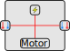

# Represent assets and get measure

An asset document represents the physical asset to which one or more devices can be linked. The document contains asset identification information, the latest measurements received by the associated devices and their metadata. It is uniquely identified by the `type` + `model` + `reference` triplet.

## Creating asset

We will create an asset that represent a fridge. Since the temperature needs to be precisely equal in the whole fridge, we need a temperature sensor in each side, in the inside and the outside. A battery power the fridge and the sensors like this :



To create our asset, execute:

```sh
curl localhost:7512/_/device-manager/my-engine/assets \
--json '{
    "type": "fridge",
    "model": "Fridger3000",
    "reference": "ref1"
  }'
```

## Link devices and asset

We will now link our device to the asset. Since our devices are not at the same place, we need to name our measures correctly:

```sh
curl localhost:7512/_/device-manager/my-engine/devices/_mLink -X PUT \
--header "Content-Type: application/json" \
--header "Accept: application/json" \
--data '{
    "linkRequests": [
      {
        "assetId": "fridge-Fridger3000-ref1",
        "engineId": "my-engine",
        "deviceLink": {
          "deviceId": "DummyMultiTemp-ref1",
          "measureNamesLinks": [
            {
              "assetMeasureName": "innerTempLeft",
              "deviceMeasureName": "innerTemp"
            },
            {
              "assetMeasureName": "outerTempLeft",
              "deviceMeasureName": "outerTemp"
            },
            {
              "assetMeasureName": "fridgeBatteryLevel",
              "deviceMeasureName": "lvlBattery"
            }
          ]
        }
      },
      {
        "assetId": "fridge-Fridger3000-ref1",
        "engineId": "my-engine",
        "deviceLink": {
          "deviceId": "DummyMultiTemp-ref2",
          "measureNamesLinks": [
            {
              "assetMeasureName": "innerTempLeft",
              "deviceMeasureName": "innerTemp"
            },
            {
              "assetMeasureName": "outerTempLeft",
              "deviceMeasureName": "outerTemp"
            },
            {
              "assetMeasureName": "fridgeBatteryLevel",
              "deviceMeasureName": "lvlBattery"
            }
          ]
        }
      }
    ]
  }'
```

Now we can test receiving our payloads like before:

```sh
curl localhost:7512/_/device-manager/payload/dummy-multi-temp \
--json '{
  "payloads": [
    {
      "deviceEUI": "ref1",
      "registerOuter": 37,
      "registerInner": -1,
      "lvlBattery": 0.89
    },
    {
      "deviceEUI": "ref2",
      "registerOuter": 38,
      "registerInner": -2,
      "lvlBattery": 0.88
    }
  ]
}'
```

Look at the measures in the `devices` or `measures` collection, you will see that the `assetMeasureName` has been added. You can also look at our asset in the collection `my-engine`:`assets`, especially the `measures`. See that it has one of each unique `assetMeasureName` (the last received), thus there will always be only one `fridgeBatteryLevel` in the asset.

To better understand how the measure is built from a payload, refer to this flowchart:


## Pushing measures without a device

You can also send a measure to an asset without a device but a real user. It is useful if another software on the network needs to push measures on the asset. Here we send a measure concerning state of the position from another source :

```sh
curl localhost:7512/_/device-manager/my-engine/assets/fridge-Fridger3000-ref1/measures \
--json '{
  "measures": [
    {
      "values": {
        "position": {
          "lat": 1,
          "lon": 2
        }
      },
      "type": "position"
    }
  ]
}'
```

The measure will have `user` as its `origin.type` and the user `kuid` as the `origin.id`. For a full explanation on how the measure is built, see this flowchart:


