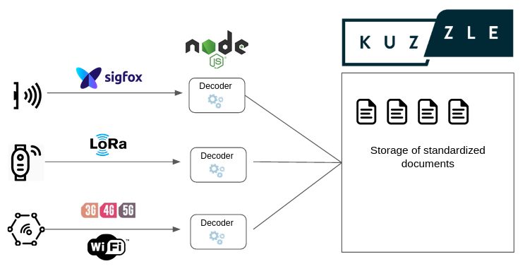

# Create a decoder

Decoders are classes in your application that include functions to validate a payload and transform them into a valid measurement for KDM. Each decoder is attached to a model of a device.



**Example:** With a device model named `DummyMultiTemp`. It is composed of 2 temperature sensors and can also send the battery level.

Here is an example of payload sended :

```js
// "DummyMultiTemp" device payload
{
  "payloads": [
    "id": "11111",      // Id of the device itself
    "registerInner": 33,    // First temperature
    "registerOuter": 34,    // Second temperature
    "lvlBattery": 0.8   // Level of the battery
  ]
}
```

We will now write the following decoder:

```ts
import { JSONObject, PreconditionError } from 'kuzzle';
import { Decoder, DecodedPayload, TemperatureMeasurement, BatteryMeasurement } from 'kuzzle-device-manager';

export class DummyMultiTempDecoder extends Decoder {
  public measures = [
    { name: 'innerTemp', type: 'temperature' },
    { name: 'outerTemp', type: 'temperature' },
    { name: 'lvlBattery', type: 'battery' },
  ] as const;

  constructor () {
    super();

    this.payloadsMappings = {
      deviceEUI: { type: 'keyword' }
    };
  }

  async validate (payload: JSONObject) {
    if (payload.payloads.find(devicePayload => ! devicePayload.deviceEUI)) {
      throw new PreconditionError('Invalid payload: missing "deviceEUI" in some devicePayload');
    }

    if (payload.invalid) {
      return false;
    }

    return true;
  }

  async decode (payload: JSONObject): Promise<DecodedPayload<Decoder>> {
    const decodedPayload = new DecodedPayload<DummyMultiTempDecoder>(this);

    for (const devicePayload of payload.payloads) {
      if (devicePayload.registerInner) {
        const innerTemp: TemperatureMeasurement = {
          measuredAt: devicePayload.measuredAtRegisterInner ?? Date.now(),
          type: 'temperature',
          values: {
            temperature: devicePayload.registerInner,
          },
        }

        decodedPayload.addMeasurement(devicePayload.deviceEUI, 'innerTemp', innerTemp);
      }

      if (devicePayload.registerOuter) {
        const outerTemp: TemperatureMeasurement = {
          measuredAt: devicePayload.measuredAtRegisterOuter ?? Date.now(),
          type: 'temperature',
          values: {
            temperature: devicePayload.registerOuter,
          },
        };

        decodedPayload.addMeasurement(devicePayload.deviceEUI, 'outerTemp', outerTemp);
      }

      if (devicePayload.lvlBattery) {
        const battery: BatteryMeasurement = {
          measuredAt: devicePayload.measuredAtLvlBattery ?? Date.now(),
          type: 'battery',
          values: {
            battery: devicePayload.lvlBattery * 100,
          },
        }

        decodedPayload.addMeasurement(devicePayload.deviceEUI, 'lvlBattery', battery);
      }
    }

    return decodedPayload;
  }
}
```

:::hint
All examples can be found in the application used for functionnal tests. The path is : `features/fixtures/application/decoders/DummyTempDecoder.ts`

Since the decoder is pretty complex to show all features of our system, you can see a simpler example here : `features/fixtures/application/decoders/DummyTempDecoder.ts`.
:::

You also need to register the decoder in the constructor of your application :

```ts
  constructor () {
    super('my-application');
    const deviceManager = new DeviceManagerPlugin();
    this.plugin.use(deviceManager);

    deviceManager.decoders.register(new DummyMultiTempDecoder());
  }
```

The project can then be launched with:

```sh
npm run docker:dev
```
