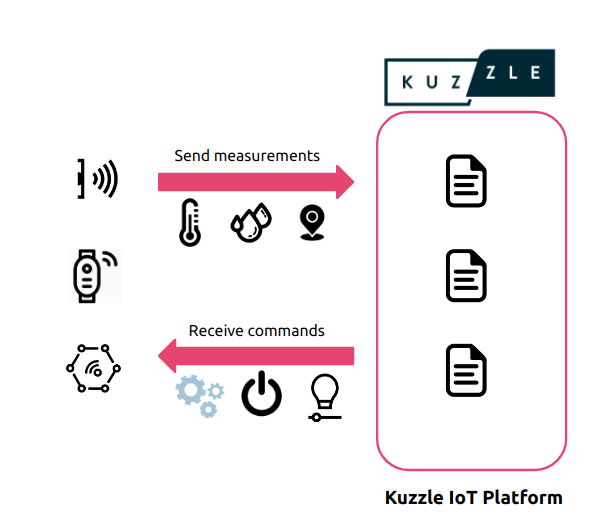
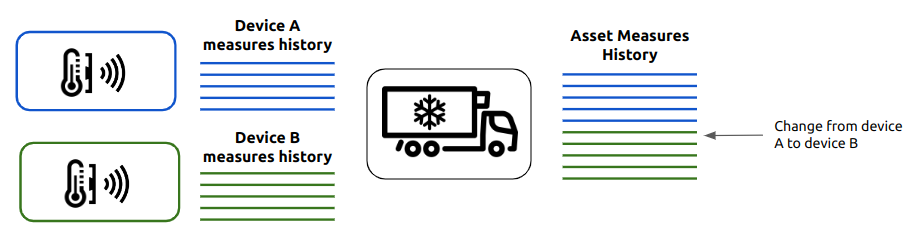
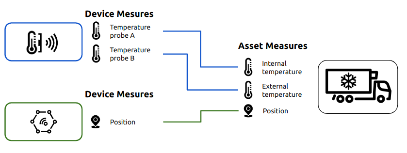

# Digital Twins: Devices and Assets

## Devices and Assets

A digital twin is a computer concept that aims to reproduce the state of an object from the real world in the digital world.

The changes of states undergone in the physical world are reflected in the digital world in order to process information in a computer system.

Synchronization is also done in reverse by controlling the operation of a real-world object from the digital world.

The digital twins of an IoT platform are one of the following 2 entities:

- the devices: represent the different data acquisition systems
- the assets: represent the objects characterized by the data

## Devices

In the Kuzzle IoT Platform, devices are the digital twins of data acquisition devices.

Example:

- GPS position device
- temperature device
- electric meter
- public lighting control

In most cases, the devices transmit their data on communication networks (4G, LoRa, NB-IoT, etc.) but the data reading can also be transmitted in the form of flat files following manual entries (for example in the case of a standard electricity meter).

Each device will be responsible for collecting one or more data points. These measurements then go back to the Kuzzle IoT Platform for standardized processing.

A device is characterized by the following information:

- unique reference (e.g. the identifier of the device on a LoRa network, `devEUI`)
- model name (e.g. `Abeeway`)
- collected measurements (e.g. a `temperature` type measurement called `internalTemperature`)
- metadata (e.g. date of last maintenance)

The devices are grouped into models, each model defines a type of device capable of collecting measurements and possessing metadata.

The Kuzzle IoT Platform is able to manage several different device models, each with their own measurements.

Each device can then be linked to an asset in order to characterize it with its measurements.

### Receive measurements

The Kuzzle IoT Platform is able to receive data through any protocol operating on an IP network. It natively supports:

-HTTP

- WebSockets
- MQTT (via gateway)
- FTP (via gateway)

_Support for a new communication protocol is available in the form of plugins._

The feedback of device measurements can be done in two ways:

- reception of data directly in the format accepted by the Kuzzle IoT Platform (see `device-manager/devices:receiveMeasures`)
- reception of raw data and normalization by a `Decoder`

The normalized measurements then systematically pass through the Ingestion Pipeline in order to be used by the Rules Engine.

## Assets

Assets are the real-world objects that have devices installed on them.

Each asset can thus be linked with one or more devices in order to be characterized by different measurements. When an asset is linked with a device, all the measurements made by the latter will be logged with this asset.

This makes it possible in particular to manage the life cycle of the devices and to have a coherent and constant measurement history on the assets independently of the maintenance and rotation operations of the devices.

In the Foobar Kuzzle IoT, the assets carry the business specific to each use case. It is them that we will specialize in order to model the real world and meet the different needs for consultation, business rules, alerts, etc.

An asset is characterized by the following information:

- unique reference (e.g. serial number)
- model name (e.g. `Container`)
- characterizing measurements (e.g. two `temperature` type measurements called `internalTemperature` and `externalTemperature`)
- metadata (e.g. container capacity, type of cargo)

Assets are grouped into models, each model defines a type of asset capable of receiving measurements and possessing metadata.

The Kuzzle IoT Platform is capable of managing several different asset models.

### Linking a device to an asset

An asset has one or more characterizing measures. Each of them must be provided by one or more devices which themselves are capable of providing several different measurements.

The operation of linking a device to an asset is carried out jointly

- in the physical world with the attachment of a device to an asset
- in the digital world with the link through the Kuzzle IoT Platform

When linking on the Kuzzle IoT Platform, it is necessary to associate one or more device measurements with one or more asset measurements.

Once linked, the measurements collected by the device will be logged for our asset with the name defined during the link.

### Historization of assets state

The successive states of the assets are systematically logged in the Kuzzle IoT Platform.

Each reception of a measurement by a device linked to an asset leads to a change in the state of the asset which will be logged.

It is the same for the modification of the metadata of an asset.

The state history entries contain all the necessary information:

- reference and model
- measures
- metadata
- type of state change

The different types of state changes are:

- receipt of a new measurement
- modification of a metadata
- associate a new device
- dissociate from a device
