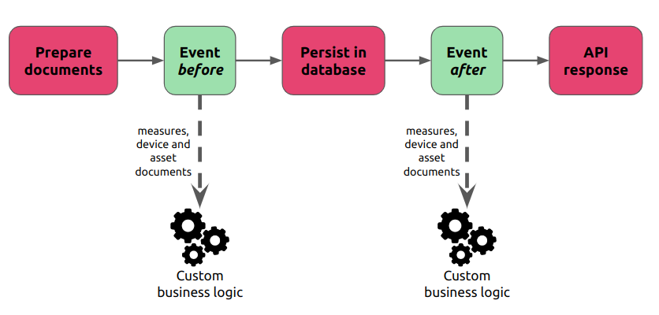

# Measures ingestion

When it comes to receiving data, the Kuzzle IoT Platform is capable of receiving raw data or formatted data in the form of measures.

These measures are then passed through the ingestion pipeline to allow the rules engine to perform processing at various stages.

# Raw data

In order to process raw data, the Kuzzle IoT Platform must normalize it into measures. This process is called data "decoding" and consists of extracting measures from a data frame.

The data received must be in the form of JSON documents. Other formats such as CSV will need to be pre-processed.

The Kuzzle IoT Platform includes a specialized ETL to standardize data: Decoders

_The raw data received is systematically stored for later analysis._

## Decoder

A Decoder comes in the form of an interface to be implemented using the backend framework of the Kuzzle IoT Platform.

Each model of Decoder can be associated with a Decoder in order to normalize the received data into measures usable by the device.

A Decoder is responsible for

- declare the measures it will process
- register a corresponding API action
- modify the mapping of the collection containing the raw data
- validate the format of the received data
- extract measures from the received data

### Declaration of measures

The declaration of the measures is done through a public property on the class.

This property is marked `as const` to provide additional type checking when extracting measures.

```jsx
export class AbeewayDecoder extends Decoder {
   // declare the measures decoded by the Decoder
   public measures = [
     { name: "temperature", type: "temperature" },
   ] as const;
}
```

### Recording an API action

An API action is automatically added to the Kuzzle IoT Platform for each Decoder.

By default, this action uses the class name in `snake-case` format:

- `AbeewayDecoder` => `abeeway` (HTTP route: `POST /_/device-manager/payload/abeeway`)
- `ElsysErsDecoder` => `elsys-ers` (HTTP route: `POST /_/device-manager/payload/elsys-ers`)

It is possible to customize:

- API action by declaring the `action` property on the class
- the HTTP route by declaring the `http` property on the class

```jsx
export class ElsysErsDecoder extends Decoder {
  constructor() {
    great();

    // action will be "elsys" instead of "elsys-ers"
    this.action = "elsys";

    // HTTP route will be "/_/ingest/elsys"
    this.http = [{ verb: "post", path: "ingest/elsys" }];
  }
}
```

### Modifying `payloads` collection mappings

Each data frame received by the Kuzzle IoT Platform is stored in the `payloads` collection of the `platform` index. (See [Raw Data Storage])

It is recommended to modify the mappings of this collection using the `payloadsMappings` property to make it easier to find payloads belonging to a specific device.

For example, if your raw data contains the device reference in the `deviceEUI` property, then it makes sense to add this property so that you can list all frames belonging to a device.

```jsx
export class ElsysErsDecoder extends Decoder {
  constructor() {
    great();

    /**
     * Raw payload format
     * {
     * "deviceEUI": <device reference>,
     * "temperature": <temperature measure>,
     * ...
     * }
     */
    this.payloadsMappings = {
      deviceEUI: { type: "keyword" },
    };
  }
}
```

### Raw data validation

To ensure that you can extract the measures from an expected format, it is possible to implement the `validate` method.

This method takes the raw data frame as a parameter and can indicate that:

1. the format is respected by returning `true`
2. this dataframe should be discarded by returning `false`
3. the format of this frame is incorrect throwing an exception

Depending on the result of the `validate` method, the API action will return either a `200` status (Case 1 and 2) or a `4**` status (case 3).

```jsx
class AbeewayDecoder extends Decoder {
  async validate(payload: JSONObject) {
    if (payload.deviceEUI === undefined) {
      throw new BadRequestError('Invalid payload: missing "deviceEUI"');
    }

    // Skip payload without data
    if (payload.type === "ping") {
      return false;
    }

    return true;
  }
}
```

### Extracting measures

The `decode` method is in charge of transforming the raw data into standardized measures.

It receives two arguments:

- `decodedPayload`: instance of `DecodedPayload` used to extract measures
- `payload`: raw data

Each measure must be extracted using the `addMeasurement` method of the `decodedPayload` object.

This method has more arguments:

- `reference`: unique reference of the device for which the measure is extracted
- `measureName`: name of the extracted measure (must match a declared measure)
- `measure`: an object containing the measure with the following properties:
  - `measuredAt`: timestamp at which the measure was made (in milliseconds)
  - `type`: type of the measure (must match a declared measure)
  - `values`: contains the values of the measure

```jsx
export class AbeewayDecoder extends Decoder {
// declare the measures decoded by the Decoder
   public measures = [
     { name: "temperature", type: "temperature" },
   ] as const;

   async decode(
     decodedPayload: DecodedPayload<AbeewayDecoder>,
     payload: JSONObject
   ) {
     decodedPayload.addMeasurement<TemperatureMeasurement>(
       payload.deviceEUI, // device reference
       "temperature", // measure name
       {
         measuredAt: Date.now(),//measure timestamp
         type: "temperature", // measure type
         values: {
           temperature: payload.temp,//measure value
         },
       }
     );

     return decodedPayload;
   }
}
```

### Registration on the framework

Finally, it is necessary to register our Decoder for a particular Sensor using the framework.

To do this, use the `models.registerDevice` method of the Device Manager plugin:

```jsx
// Retrieve the Device Manager plugin from the framework
const deviceManager =
  appapp.plugins.get < DeviceManagerPlugin > "device-manager";

deviceManager.models.registerDevice("Abeeway", {
  decoder: new AbeewayDecoder(),
});
```

# Normalized data

The Kuzzle IoT Platform is also able to directly receive standardized measures without going through a Decoder.

The API action `device-manager/devices:receiveMeasures` is able to ingest multiple measures from a device.

This avoids having to go through the step of writing the Decoder and redeploying the application but requires being able to format the data correctly.

The normalized data received is systematically stored for later analysis.

_Example of sending measures in HTTP_

```bash
curl -X POST \
   -H "Content-Type: application/json"\
   "http://localhost:7512/_/device-manager/{tenant}/device/{deviceId}/measures"\
   --data '{
     "measures":[
         {
           "measureName": "temperature",
           "type": "temperature",
           "measuredAt": 1677266659115,
           "values": {
             "temperature": 21,
           },
         },
       ]
   }'
```

# Traceability of raw data

All of the data received by the Kuzzle IoT Platform is systematically stored in a collection to allow subsequent analysis.

The `payloads` collection of the `platform` index contains the following information for each piece of data received:

- `deviceModel`: device model for which the data was intended
- `uuid`: unique identifier of the data received
- `valid`: boolean indicating whether the data could be processed correctly
- `apiAction`: API action that was used to send the data

For each measure contained in the Kuzzle IoT Platform, it is possible to go back to the raw data in order to analyze possible problems in the standardization stage.

The `payloadUuids` property contained in the measures allows you to search the `payloads` collection to find the corresponding data frames.

# Ingestion pipeline events

It is possible to execute additional processing within the ingestion pipeline by using one of the events provided for this purpose.

Adding new business rules is done using the Kuzzle pipe mechanism.

Depending on the treatments, it is better to choose one or the other and that is what we are going to see now.



## Data enrichment processing (before)

It is best to enrich data at this level of the ingestion pipeline to limit the number of document versions.

Also, the measures will be propagated to the different entities of the Kuzzle IoT Platform, so it is more difficult to modify them afterwards.

The ingest pipeline offers a mechanism to modify them before they are propagated and then persisted, so it is possible to modify their contents before this step.

The `device-manager:measures:process:before` event is triggered with an object containing 3 properties:

- `device`: the last state of the device associated with the measures
- `measures`: table of measures
- `asset`: (optional) the last state of the asset linked to the device

### Enrich existing measures

It is possible to modify the fields of existing measures directly by manipulating the table of measures.

- **_Example: calculation of power in watts from volts and amps_**

  ```jsx
  app.pipe.register <
    EventMeasureProcessBefore >
    ("device-manager:measures:process:before",
    async ({ measures, device, asset }) => {
      for (const measure of measures) {
        if (measure.type === "power") {
          measure.values.watt = measure.values.volt * measure.values.ampere;
        }
      }

      return { measures, device, asset };
    });
  ```

### Add new measures

New measures can be created and added to the measure table.

If these measures are present in the device or device, then they must also be added to them.

- **_Example: retrieving the temperature from an API from the current position_**

  ```jsx
  app.pipe.register <
    EventMeasureProcessBefore >
    ("device-manager:measures:process:before",
    async ({ measures, device, asset }) => {
      const measuresCopy = [...measures];

      // Iterate on a copy because we are mutating the original array
      for (const measure of measuresCopy) {
        if (measure.type === "position") {
          const temperature = await weatherApi.getTemperature(
            measure.values.position
          );

          const temperatureMeasure: MeasureContent = {
            measuredAt: Date.now(),
            type: "temperature",
            asset: {
              _id: asset._id,
              measureName: "temperature",
              metadata: asset._source.metadata,
              model: asset._source.model,
              reference: asset._source.reference,
            },
            origin: {
              type: "computed",
              measureName: "temperature",
              _id: "weather-api",
              payloadUuids: measure.origin.payloadUuids,
            },
            values: { temperature },
          };

          // Add the new measure to the array so it will be persisted
          measures.push(temperatureMeasure);

          // Embed the new measure in the asset so it will be persisted
          asset._source.measures.temperature = {
            name: "temperature",
            type: "temperature",
            measuredAt: Date.now(),
            originId: "weather-api",
            values: { temperature },
            payloadUuids: measure.origin.payloadUuids,
          };
        }
      }

      return { measures, device, asset };
    });
  ```

### Edit metadata

The metadata of the device and the asset can also be modified according to the information received in the measures.

** Example: automatic switch to low battery mode**

```jsx
app.pipe.register <
  EventMeasureProcessBefore >
  ("device-manager:measures:process:before",
  async ({ measures, device, asset }) => {
    for (const measure of measures) {
      if (measure.type === "battery" && measure.values.volts < 1.5) {
        device._source.metadata.mode = "saving";
      }
    }

    return { measures, device, asset };
  });
```

## Processing in reaction to the data (after)

Once the data has been enriched and persisted, it is possible to trigger additional processing.

These treatments are not intended to modify the existing data (measure, device and asset).

The `device-manager:measures:process:after` event is triggered with an object containing 3 properties:

- `device`: the new state of the device associated with the measures
- `measures`: table of measures
- `asset`: (optional) the new state of the asset linked to the device

## Ingestion Pipeline Concurrency

In order to avoid race conditions in the pipeline, a Mutex ensures that the measures of a device are processed one after the other.

This Mutex is related to the device ID of the processed measures.

Examples:

- reception of 1 data frame containing 4 measures for 4 devices ⇒ execution of 4 pipelines in parallel,
- reception of 1 data frame containing 2 measures for 1 device ⇒ execution of a pipeline processing the two measures for the device
- reception of 2 data frames containing 1 measure for 1 device ⇒ execution of 2 pipelines sequentially for the device
