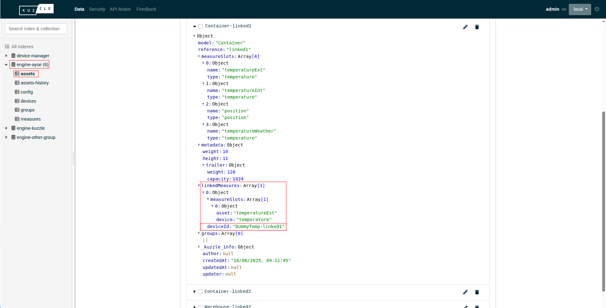
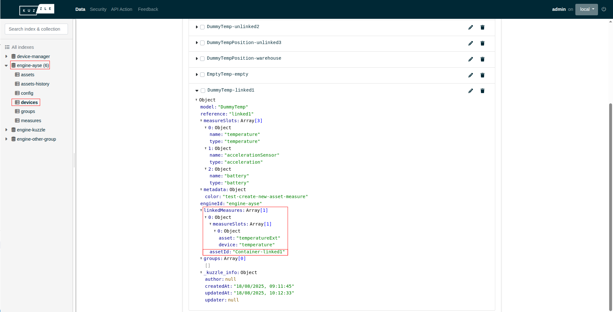
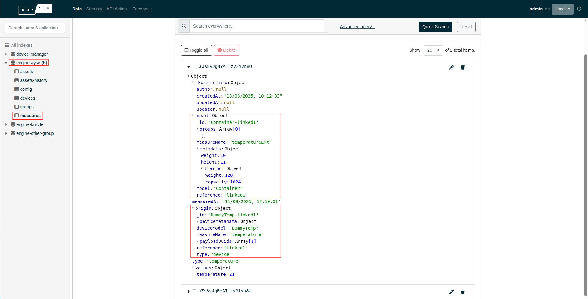

# Measures linkage

Assets and devices can be linked through common measurements.

An asset can have measures linked with different devices. Similarly a device can have measures linked with different assets. Each digitial twin can have only one link per measure slot.

## Link in digital twins

In the tenant index, the link will be displayed in the array `linkedMeasures` of the `devices` and `assets` collections. Each item of this array represents a link with a digital twin. It contains:
- The `assetId` or `deviceId` depending of the type of the digital twin.
- An array of `measureSlots` linked between the two digital twins. Those slots indicates the name of the measurement used for the asset and for the device.

## Link in measures

In measure documents, the device is represented in the `origin` property, if an asset measure is linked to it, it appears in the `asset` property.

