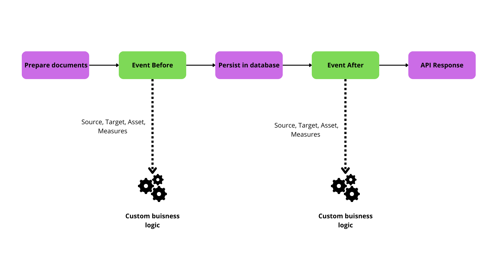

# Measures ingestion

When it comes to receiving data, the Kuzzle IoT Platform is capable of receiving raw data or formatted data in the form of measures.

These measures are then passed through the ingestion pipeline to allow to perform processing at various stages.

## Raw data

In order to process raw data, the Kuzzle IoT Platform must normalize it into measures. This process is called data "decoding" and consists of extracting measures from a data frame.

The data received must be in the form of JSON documents. Other formats such as CSV will need to be pre-processed.

The Kuzzle IoT Platform includes a specialized ETL to standardize data: Decoders

_The raw data received is systematically stored for later analysis._

## Decoder

A Decoder comes in the form of an interface to be implemented using the backend framework of the Kuzzle IoT Platform.

Each model of Decoder can be associated with a Decoder in order to normalize the received data into measures usable by the device.

A Decoder is responsible for

1. declare the measures it will process
2. register a corresponding API action
3. (optional) modify the mapping of the collection containing the raw data
4. (optional) validate the format of the received data
5. extract measures from the received data

### Declaration of measures

The declaration of the measures is done through a public property on the class.

This property is marked `as const` to provide additional type checking when extracting measures.

```jsx
export class AbeewayDecoder extends Decoder {
   // declare the measures decoded by the Decoder
   public measures = [
     { name: "temperature", type: "temperature" },
   ] as const;
}
```

### Recording an API action

An API action is automatically added to the Kuzzle IoT Platform for each Decoder.

By default, this action uses the class name in `snake-case` format:

- `AbeewayDecoder` => `abeeway` (HTTP route: `POST /_/device-manager/payload/abeeway`)
- `ElsysErsDecoder` => `elsys-ers` (HTTP route: `POST /_/device-manager/payload/elsys-ers`)

It is possible to customize:

- API action by declaring the `action` property on the class
- the HTTP route by declaring the `http` property on the class

```jsx
export class ElsysErsDecoder extends Decoder {
  constructor() {
    super();

    // action will be "elsys" instead of "elsys-ers"
    this.action = "elsys";

    // HTTP route will be "/_/ingest/elsys"
    this.http = [{ verb: "post", path: "ingest/elsys" }];
  }
}
```

### Modifying `payloads` collection mappings

Each data frame received by the Kuzzle IoT Platform is stored in the `payloads` collection of the `platform` index. See [Raw Data](#raw-data).

It is recommended to modify the mappings of this collection using the `payloadsMappings` property to make it easier to find payloads belonging to a specific device.

For example, if your raw data contains the device reference in the `deviceEUI` property, then it makes sense to add this property so that you can list all frames belonging to a device.

```ts
export class ElsysErsDecoder extends Decoder {
  constructor() {
    super();

    /**
     * Raw payload format
     * {
     * "deviceEUI": <device reference>,
     * "temperature": <temperature measure>,
     * ...
     * }
     */
    this.payloadsMappings = {
      deviceEUI: { type: "keyword" },
    };
  }
}
```

### Raw data validation

To ensure that you can extract the measures from an expected format, it is possible to implement the `validate` method.

This method takes the raw data frame as a parameter and can indicate that:

1. the format is respected by returning `true`
2. this dataframe should be discarded by returning `false`
3. the format of this frame is incorrect throwing an exception

Depending on the result of the `validate` method, the API action will return either a `200` status (Case 1 and 2) or a `4**` status (case 3).

For each case, a state and a reason is stored inside the payload document:

1. the payload has a VALID state.
2. the payload is discarded by user validation and has a SKIP state and a dedicated reason (which can be overridden by throwing a SkipError exception).
3. the payload has an ERROR state and a reason equal to the error message.

```ts
class AbeewayDecoder extends Decoder {
  async validate(payload: JSONObject) {
    if (payload.deviceEUI === undefined) {
      throw new BadRequestError('Invalid payload: missing "deviceEUI"');
    }

    // Skip payload without data
    if (payload.type === "ping") {
      return false;
    }

    return true;
  }
}
```

### Extracting measures

The `decode` method is in charge of transforming the raw data into standardized measures.

It receives three arguments:

- `decodedPayload`: instance of `DecodedPayload` used to extract measures
- `payload`: raw data
- `request`: Kuzzle request

Each measure must be extracted using the `addMeasurement` method of the `decodedPayload` object.

This method has more arguments:

- `reference`: unique reference of the device for which the measure is extracted
- `measureName`: name of the extracted measure (must match a declared measure name)
- `measure`: an object containing the measure with the following properties:
  - `measuredAt`: timestamp at which the measure was made (in milliseconds)
  - `type`: type of the measure (must match a declared measure type)
  - `values`: contains the values of the measure

```ts
export class AbeewayDecoder extends Decoder {
// declare the measures decoded by the Decoder
   public measures = [
     { name: "external temperature", type: "temperature" },
   ] as const;

   async decode(
     decodedPayload: DecodedPayload<AbeewayDecoder>,
     payload: JSONObject,
     request: KuzzleRequest
   ) {
     decodedPayload.addMeasurement<TemperatureMeasurement>(
       payload.deviceEUI, // device reference
       "external temperature", // measure name
       {
         measuredAt: Date.now(),//measure timestamp
         type: "temperature", // measure type
         values: {
           temperature: payload.temp,//measure value
         },
       }
     );

     return decodedPayload;
   }
}
```
- `request` can be use to interract with [kuzzle request](https://docs.kuzzle.io/core/3/framework/classes/kuzzle-request/properties/) as documented onto kuzzle documentation. (ex: configure response format using [`request.response.configure`](https://docs.kuzzle.io/core/3/framework/classes/request-response/configure/).)

### Registration on the framework

Finally, it is necessary to register our Decoder for a particular Sensor using the framework.

To do this, use the `models.registerDevice` method of the Device Manager plugin:

```jsx
// Retrieve the Device Manager plugin from the framework
const deviceManager =
  app.plugins.get < DeviceManagerPlugin > "device-manager";

deviceManager.models.registerDevice("Abeeway", {
  decoder: new AbeewayDecoder(),
});
```

## Normalized data

The Kuzzle IoT Platform is also able to directly receive standardized measures without going through a Decoder.

The API action `device-manager/devices:receiveMeasures` is able to ingest multiple measures from a device.

This avoids having to go through the step of writing the Decoder and redeploying the application but requires being able to format the data correctly.

The normalized data received is systematically stored for later analysis.

_Example of sending measures in HTTP_

```bash
curl -X POST \
   -H "Content-Type: application/json"\
   "http://localhost:7512/_/device-manager/{tenant}/device/{deviceId}/measures"\
   --data '{
     "measures":[
         {
           "measureName": "temperature",
           "type": "temperature",
           "measuredAt": 1677266659115,
           "values": {
             "temperature": 21,
           },
         },
       ]
   }'
```

## Traceability of raw data

All of the data received by the Kuzzle IoT Platform is systematically stored in a collection to allow subsequent analysis.

The `payloads` collection of the `platform` index contains the following information for each piece of data received:

- `deviceModel`: device model for which the data was intended
- `uuid`: unique identifier of the data received
- `valid`: boolean indicating whether the data could be processed correctly
- `apiAction`: API action that was used to send the data
- `state`: the state of the payload : VALID if it's valid, SKIP if the payload is skipped by the user during validation or ERROR if an error is raised during payload reception.
- `reason`: the reason of an error if the payload is in error (otherwise it will be undefined).

For each measure contained in the Kuzzle IoT Platform, it is possible to go back to the raw data in order to analyze possible problems in the standardization stage.

The `payloadUuids` property contained in the measures allows you to search the `payloads` collection to find the corresponding data frames.

## Measures Sources

Measures can originate from different sources:

### Device Measure Source

Represents measures coming directly from a physical device.

- **Properties:**
  - `type`: Always "device"
  - `id`: Unique identifier of the source
  - `reference`: Device reference
  - `deviceMetadata`: Metadata of the device
  - `model`: Device model
  - `lastMeasuredAt`: (optional) Timestamp of the last measurement

### API Measure Source

Represents measures coming from an API call.

- **Properties:**
  - `type`: Always "api"
  - `id`: Unique identifier of the source

## Measures Targets

Measures are directed towards specific targets:

### Device Measure Target

Targets a device entity within the platform.

- **Properties:**
  - `type`: Always "device"
  - `assetId`: (optional) linked Asset identifier
  - `indexId`: Index identifier

### API Measure Target

Targets an API entity or external systems.

- **Properties:**
  - `type`: Always "api"
  - `assetId`: Associated asset identifier
  - `engineGroup`: (optional) Specific engine group targeted
  - `indexId`: Index identifier


## Events Emitted During Measure Processing

To enrich or modify measures during ingestion, the Kuzzle IoT Platform provides events emitted at various stages. Below are the details on events triggered during measure processing:



### Event Before process : `device-manager:measures:process:before`

Triggered before measures are processed and persisted. Ideal for enriching measures or adjusting metadata prior to saving.

- **Event properties:**
  - `source`: Origin of the measures (Device or API).
  - `target`: Intended target for the measures (Device or API).
  - `asset`: (optional) Asset associated with the device.
  - `measures`: Array of measures to be processed.

_Example of enriching a measure:_

```javascript
app.pipe.register('device-manager:measures:process:before', async ({ measures, source, target, asset }) => {
  for (const measure of measures) {
    if (measure.type === "temperature" && measure.values.celsius) {
      measure.values.fahrenheit = measure.values.celsius * 9/5 + 32;
    }
  }

  return { measures, source, target, asset };
});
```

### Tenant-specific event

An isolated tenant-specific event variant is also available:

```typescript
engine:<engine-id>:device-manager:measures:process:before
```

### Event After Process(`device-manager:measures:process:after`)

Triggered after measures have been processed and persisted. Suitable for triggering further actions based on new data.

- **Event properties:**
  - `source`: Origin of the measures.
  - `target`: Destination for the measures.
  - `asset`: (optional) Updated asset state associated with the measures.
  - `measures`: Array of persisted measures.

_Example: Trigger an alert after processing measures_

```javascript
app.pipe("device-manager:measures:process:after", async ({ measures, source, asset }) => {
  for (const measure of measures) {
    if (measure.type === "security_alert" && measure.values.alertType === "forced_entry") {
      notifySecurityTeam(asset, measure);
    }
  }

  return { measures, source, target, asset };
});
```

### Tenant-specific events

Tenant-specific events are also available for isolated measure processing:

- **Before processing:**
  - `engine:<engine-id>:device-manager:measures:process:before`
- **After processing:**
  - `engine:<engine-id>:device-manager:measures:process:after`

These events carry the same properties as their global counterparts and allow for tenant-specific customizations and workflows.

