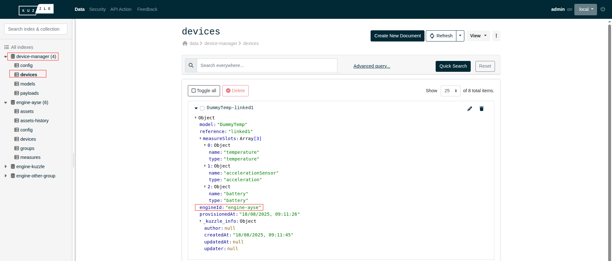

# Measures propagation

The raw data received by the Kuzzle IoT Platform contains measurements that must be propagated within the different entities of the platform.

By default, measurements are stored in the `platform/payloads` collection as raw data frames

If **the device is assigned to a tenant**, then the measurements are propagated in the `<tenant>/measures` collection as measures (`MeasureContent`)

If **the device is not assigned to a tenant**, then the measurements are propagated in the in the `platform/devices`  collection as embedded measures  (`EmbeddedMeasure`) in the `lastMeasures` property.

## Mechanisms of propagation

Propagation is governed by a set of rules contained in devices and assets.

### Propagation in tenant engine

Tenant engine propagation occurs when the device is attached to a tenant with the `device-manager/devices:attachEngine` action.

The `engineId` text field of the device contains the index name of the tenant it was attached to.

The measures are then propagated in the `<tenant>/measures` collection as measures (`MeasureContent`).

If this field is `null`, then the device is not attached to a tenant and measurements are not propagated.

It is possible to check the assignment in the Admin Console:

_The `DummyTemp-linked1` device is assigned to the `engine-ayse` tenant._